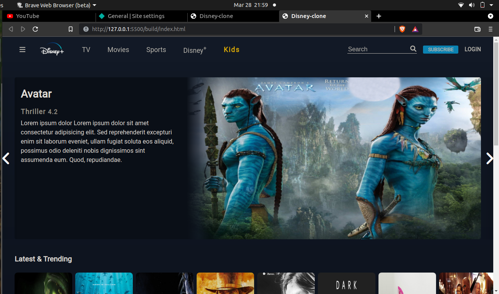
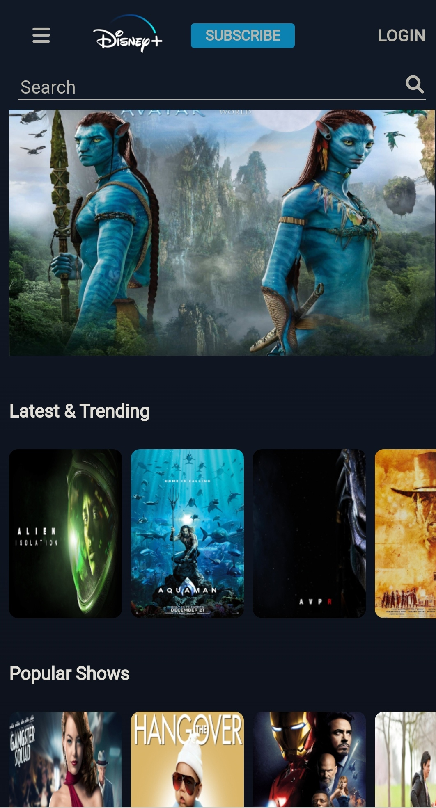

# Disney clone 
I like real world projects (twitter, facebook), some times i wondered how they create this one? how much knowledge need to create like this? that's the begining stage of starting this project. And i finally finished the "Disney-plus" clone static website project today. I'm so happy and exicited, thanks to [clever programmer](https://www.youtube.com/c/CleverProgrammer) inspire to build this project.
	
## find it on online 
You can also view my project in online, i put it on [netlify](https://www.netlify.com) (netlify is a free static site hosting plateform)

>[disney-plus-clone](https://nazim-disney-clone.netlify.app)
	
## used features
- ***pug*** => compile to html, short and easier more flexible 
- ***sass*** => compile to css, lot of features available in there (mixin, loop, placeholder) 
- ***babel*** => compile latest javascript into old version browser (es2015)
- ***eslint*** => find errors and make coding style better
- ***prettier*** => used for code alignment
- ***grunt.js*** => task runner, at the same we can run multiple task using grunt
- ***npm*** => node based package manager, npm is a server we can install packages or publish a new package 

>>>>>>> deploy

## view

```
Desktop
```




```
mobile
```


